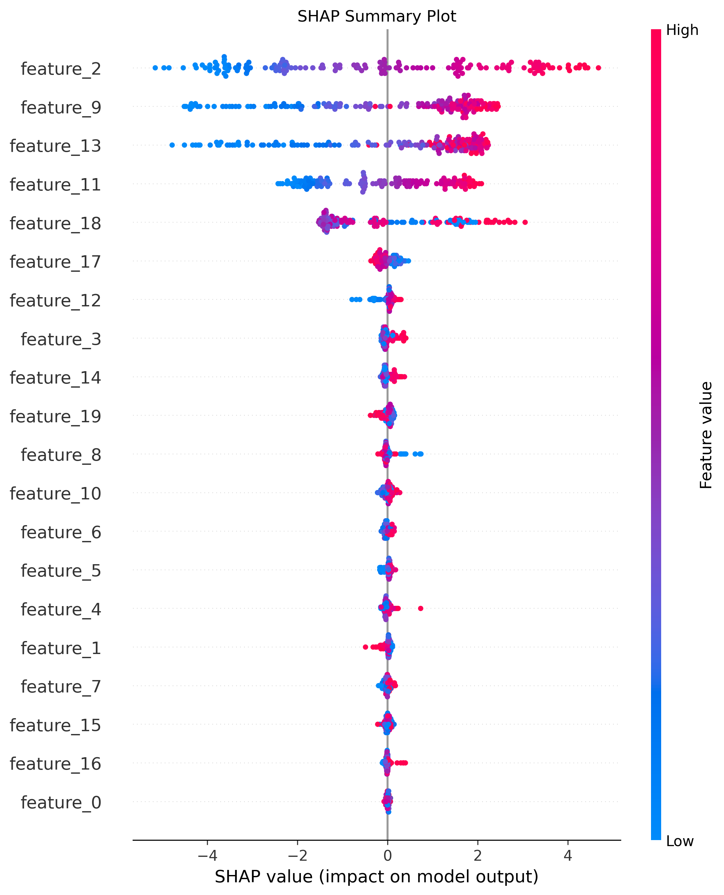
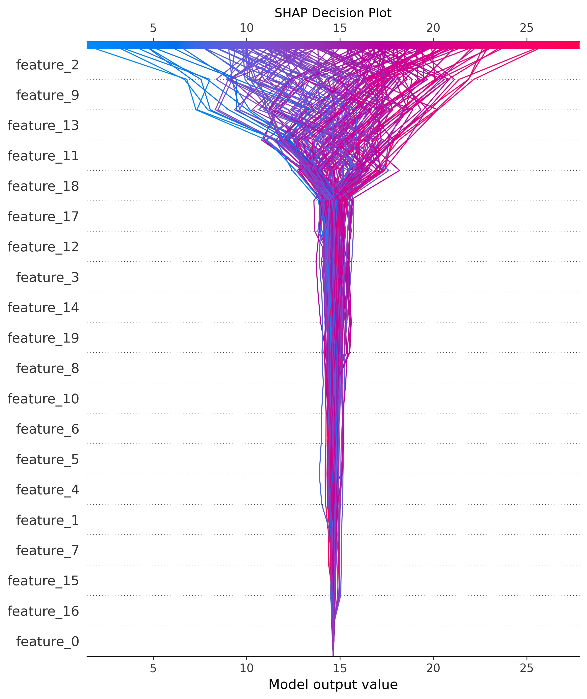

# Multivariate Regression API with Model Interpretation

## Overview

This project provides a comprehensive pipeline for supervised multivariate regression using **Catboost**. The system facilitates exploratory data analysis (EDA), robust preprocessing, model training, hyperparameter tuning, and interpretability through **SHAP** and **Feature Importance** techniques. The API serves predictions via a Flask-based interface, allowing single-instance queries and batch processing through CSV uploads.

### Purpose of Each Section:
- **EDA**: Extract statistical insights, detect correlations, analyze distributions, and identify outliers.
- **Preprocessing**: Ensure data quality, feature selection, scaling, and partitioning.
- **Model Training & Selection**: Optimize and validate models through hyperparameter tuning and k-fold cross-validation.
- **Evaluation**: Assess performance using various regression metrics, emphasizing error minimization and robustness.
- **Deployment & API**: Enable model inference through REST API endpoints.
- **Interpretability**: Utilize **SHAP** and **Feature Importance** to enhance explainability in decision-making.

## Setup and Execution

### Clone Repository

```sh
git clone <repository-url>
cd <repository-folder>
```

### Install Dependencies

```sh
pip install -r requirements.txt
```

### Run API Server

```sh
python api.py
```

### Access API

Open [http://127.0.0.1:5000/](http://127.0.0.1:5000/) in your local browser.

## API Endpoints

### Predict Single Instance

**POST** `/predict`

### Predict from CSV

**POST** `/predict_csv`

#### Upload CSV file containing required features.

### Interpretation Methods

- **Feature Importance**: Ranks input features by predictive significance.
- **SHAP Values**: Allocates contributions of each feature to an individual prediction.
- **None**: Outputs only numerical predictions.

## Exploratory Data Analysis (EDA)

- **Summary Statistics**: Compute count, mean, standard deviation, quartiles, and missing values.
- **Correlation Matrix**: Analyze feature dependencies using Pearson, Spearman, and Kendall coefficients.
- **Variance & Covariance**: Identify variability across features and their linear relationships.
- **Distribution Analysis**: Visualize data behavior using histograms, KDE, and boxplots.
- **Principal Component Analysis (PCA)**: Reduce dimensionality while preserving variance.
- **Clustering Techniques**: Evaluate K-Means and DBSCAN for feature grouping.
- **Outlier Detection**: Apply **Z-score** and **IQR-based** methods to detect potential outliers in distributions of features.


## Preprocessing (ETL Pipeline)

- **Data Cleaning**: Handle missing values and outliers.
- **Feature Selection**: Define predictors (`X`) and regression target (`Y`).
- **Train-Test Splitting**: Divide dataset for generalization testing.
- **Standardization**: Scale features to normalize distributions.

## Model Training & Selection

- **Optuna Optimization**:
  - Bayesian search for hyperparameter tuning.
  - Objective: **Minimize MSE** using **100 trials** with **5-fold cross-validation**.
- **BayesSearchCV**:
  - Grid search over Bayesian-optimized hyperparameters.
  - K-fold cross-validation ensures robustness.


## Model Evaluation

Regression performance metrics:

- **Mean Squared Error (MSE)**: Square penalty for large errors.
- **Root Mean Squared Error (RMSE)**: Measures error in the original scale.
- **Mean Absolute Error (MAE)**: Average absolute deviations.
- **Explained Variance Score**: Percentage of variance explained by the model.
- **Mean Absolute Percentage Error (MAPE)**: Relative percentage error against actual values.


## Model Interpretation

### Feature Importance Plot

- Evaluates feature weight impact on predictions.
- Extracted directly from the XGBoost model.

### SHAP Summary & Decision Plots

- **SHAP Summary Plot**: Global feature attribution.
- **SHAP Decision Plot**: Visualizes feature impact on specific predictions.
- **SHAP Force Plot**: Displays instance-level influence.






## Model Deployment

- Flask-based REST API for local inference.
- **Interactive UI**: Enables direct input and visualization.
- **Batch Prediction**: Supports CSV-based bulk processing.

## Solutions Architecture Evolution
### Azure Cloud-Native Solutions Architecture for Multivariate Regression


This section details the migration of a multivariate regression application to a cloud-native environment in **Microsoft Azure**, optimizing for **parallel execution, modularity, scalability, and cost efficiency**.

## Azure Services Overview

### **1. Data Orchestration: Azure Data Factory (ADF)**
- **Purpose**: End-to-end orchestration of the ML pipeline, automating data ingestion, transformation, and model training.
- **Integration**:
  - **Integration Runtime (IR)**: Hybrid data movement between on-premises and cloud environments.
  - **Linked Services**: APIs, VMs, SQL Servers, Azure Blob Storage, Synapse Analytics, and Databricks.
  - **ETL Execution**: Runs notebooks/scripts in **Azure Databricks** and **Azure ML**.

### **2. Data Storage & Medallion Architecture: Azure Blob Storage**
- **Purpose**: Implement Bronze (raw), Silver (processed), and Gold (validated) data layers.
- **Key Features**:
  - **Metadata and Hyperparameter Management** via **Azure Utility Catalog**.
  - **Autoloader** for real-time ingestion.
  - **Batch Processing** for large-scale data transformations.

### **3. Data Processing & Model Development: Azure Databricks**
- **Purpose**: Scalable distributed computing for data preparation, model training, and model registration.
- **Optimization Techniques**:
  - **Multi-node, multi-core clusters**: High-performance parallel execution.
  - **ThreadPool Parallelization**: Optimized for **distributed ML experiments**.
  - **Delta Lake**: Version-controlled datasets for reproducibility.
  
### **4. Performance Monitoring: Azure Synapse Analytics**
- **Purpose**: Cost and performance monitoring of model execution.
- **Implementation**:
  - Logs job execution performance.
  - Cost analytics for optimal resource allocation.

### **5. Model Training & Deployment: Azure Databricks & Azure ML**
- **Training Pipeline**:
  - **Feature Engineering** in Databricks notebooks.
  - **Hyperparameter Tuning** using Azure ML.
  - **MLflow Integration**: Model tracking and lineage.
- **Model Registry**:
  - Versioning and lifecycle management.
  - Staging models for deployment.
  
### **6. API Deployment: Azure Function App**
- **Purpose**: Serve model inference via API endpoints.
- **Single and Batch Prediction**:
  - **Real-time inference** for single requests.
  - **Batch scoring** for large datasets.
- **Integration**:
  - Consumes models from **Azure ML Model Registry**.
  - Writes predictions to **Azure SQL Database** or **Blob Storage**.

### **7. Model Monitoring & Retraining**
- **Purpose**: Automate model retraining based on performance thresholds.
- **Implementation**:
  - **Drift Detection**: Monitor changes in data distributions.
  - **Performance Checkpoints**: If degradation exceeds a threshold, trigger a retraining job.
  - **Scheduled Retraining Pipelines**: Optimized for cost-efficient model refresh.

## Architectural Optimization Strategies
- **Multi-node execution**: High-throughput Databricks clusters with optimized resource allocation.
- **Parallelization**:
  - **ThreadPool-based multi-core execution** for batch processing.
  - **Distributed ML pipelines** for hyperparameter tuning.
- **Cost Optimization**:
  - Autoscaling clusters in Databricks.
  - Spot VM instances for cost-efficient compute.
  - Performance monitoring via **Synapse Analytics**.
- **Modularization**:
  - **Microservices-based API deployment**.
  - **Decoupled ETL, training, and inference pipelines**.
- **Unit Testing & CI/CD**:
  - **Automated unit tests** for data validation and model accuracy.
  - **CI/CD pipelines** in Azure DevOps for deployment automation.

## Conclusion
This **Azure-native architecture** enables a **highly scalable, efficient, and modular** multivariate regression pipeline. It ensures **real-time monitoring, adaptive retraining, and cost-effective inference**, leveraging **state-of-the-art cloud technologies**.


## References


- D. Peña, Análisis de Datos Multivariantes. Madrid, Spain: Editorial Prentice Hall, 2002.

- S. Suresh, Hands-On Exploratory Data Analysis with Python. Birmingham, UK: Packt Publishing, 2020.

- G. James, D. Witten, T. Hastie, and R. Tibshirani, An Introduction to Statistical Learning. New York, NY, USA: Springer, 2013.

- T. Hastie, R. Tibshirani, and J. Friedman, The Elements of Statistical Learning: Data Mining, Inference, and Prediction, 2nd ed. New York, NY, USA: Springer, 2009.

- B. Schölkopf and A. J. Smola, Learning with Kernels: Support Vector Machines, Regularization, Optimization, and Beyond. Cambridge, MA, USA: MIT Press, 2002.

- S. M. Lundberg and S.-I. Lee, "A unified approach to interpreting model predictions," in Advances in Neural Information Processing Systems, vol. 30, 2017, pp. 4765–4774.